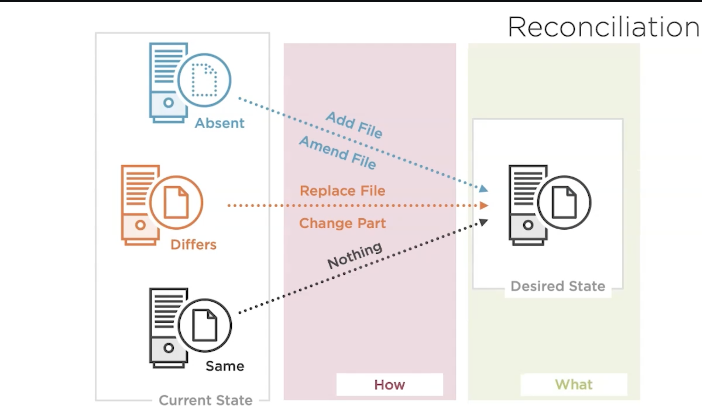
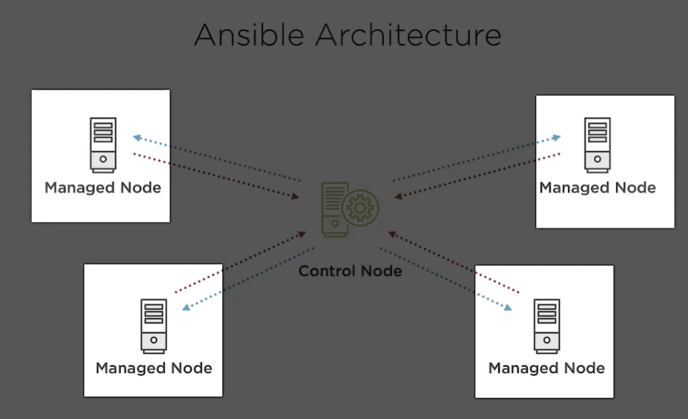

## Git Config use case

Setting user name and email in git config for making commits.

```
git config --global user.name username
git config --global --add user.email username@no-reply.com
```

* Very common user case and any system we start using. This has to be done.

* Can be automated using a shell script.

```
git-config.sh

git config --global user.name username
git config --global --add user.email username@no-reply.com

sh git-config.sh // does the job
```

## Idempotence

* This issue with using the shell script is that it doesn't take care of idempotence.

* we run it multiple times, git add will add duplicate entrys in git config file.

* Now we can make it idempotennt, but that would be a ***difficult undertaking***

```
// lame attempt to idempontence

if [[ -f ~/.gitconfig ]]; then
    isName = `cat ~/.gitconfig | grep 'user.name'`
    if [[ isName ]]; then
        // add config
        git config --global --add user.name "testuser"
    fi
fi
// see the difficulty???????????????
```

## Declarative & Re-conciliation

* Focusing on ***WHAT*** instead of ***HOW***




## Installing Ansible

```
pip install -U pip
pip install ansible
ansible --version

pip list --outdated
pip list --outdated --pre // releases like RC. not stable

pip install -U ansible // upgrading
```

## Porting guides
[porting docs](https://docs.ansible.com/ansible/latest/porting_guides/porting_guides.html)

## Ansible Architecture



* Most common communication between control node & managed nodes happen over ***SSH***

But there are other options as well.

```
ansible-doc -t connection -l
```


## Ansible Doc command

```
ansible-doc -t connection -l
ansible-doc <plugin type flag> <name of plugin>  <list flag>
```

## Using Adhoc commands

* Typing ansible tab, gives following commands

```
ansible tab
ansible             ansible-connection  ansible-doc         ansible-inventory   ansible-pull        
ansible-config      ansible-console     ansible-galaxy      ansible-playbook    ansible-vault
```

* Adhoc commands are for ***one off*** tasks.

```
ansible -h / --help
```

* Module Index
[](https://docs.ansible.com/ansible/latest/modules/modules_by_category.html)