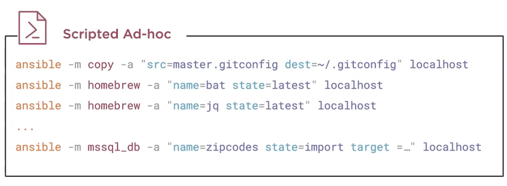
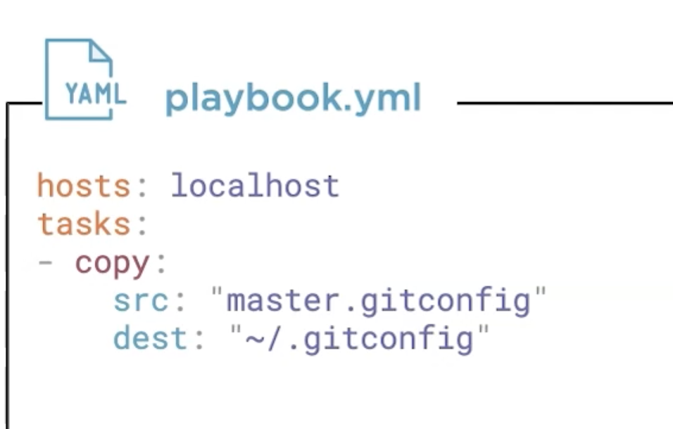

* Can we just write all the adhoc commands in one file and call it a day!!

* ***Not a GOOD*** option since every ansible call does the fact check and repeating that is inefficient.

## Two styles to define Tasks

1. Euqal To delimeted

2. Colon separated

## Working with Playbooks
["working with playbooks"](https://docs.ansible.com/ansible/latest/user_guide/playbooks.html)