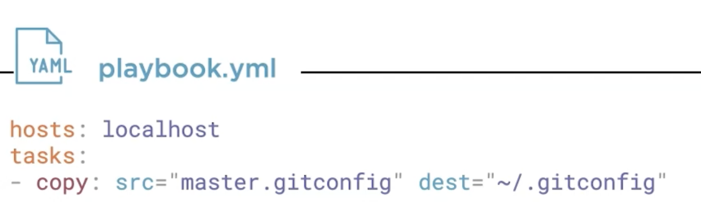
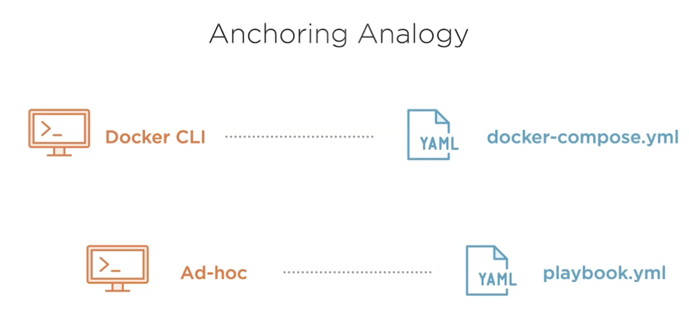
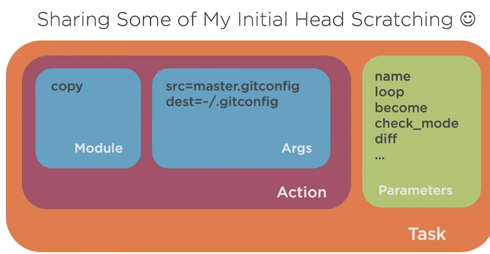
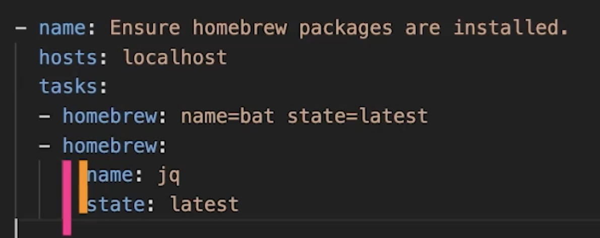

* Can we just write all the adhoc commands in one file and call it a day!!


* ***Not a GOOD*** option since every ansible call does the fact check and repeating that is inefficient.

## Two styles to define Tasks

1. Euqal To delimeted


2. Colon separated


## Working with Playbooks
["working with playbooks"](https://docs.ansible.com/ansible/latest/user_guide/playbooks.html)



* Playbooks comprises of plays.

* Simple playbook for the .gitconfig usecase

```
---
  # ansible -m copy -a "src=master.giconfig dest=~/.gitconfig"

  - name: Ensure master.gitconfig file is present
    hosts: localhost
    tasks:
      - copy: src="master.gitconfig" dest="~/.gitconfig"
```
* What are tasks?



* ***Fact Gathering*** the first thing happening when we executed the playbook was the Task Gathering Facts. This is how ansible finds the current state of the environment. This is done using ***setup*** module.

Equivalent to this:

```
ansible -m setup localhost
```

* by ***default*** it is true. But can be turned off in the playbook by saying like shown below. This helps in speed things up, when facts are not required.

```
gather_facts: false
```

Similar to gather_facts there are other ***playbook keywords.***
[](https://docs.ansible.com/ansible/latest/reference_appendices/playbooks_keywords.html)

Example usage in a playbook:

```
simple_playbook.yaml

  - name: Ensure master.gitconfig file is present
    hosts: localhost
    gather_facts: false
    tasks:
      - copy:
          src: "master.gitconfig"
          dest: "~/.gitconfig"

ansible-playbook simple_playbook.yaml
```

* Increasing ***Verbosity*** of the playbook run output:

```
ansible-playbook simple_playbook.yaml -v
ansible-playbook simple_playbook.yaml -vv
ansible-playbook simple_playbook.yaml -vvvv
```

# Indentation
* Tasks (using modules) are at level ***pink***
* Arguments to these modules are at ***yellow***



