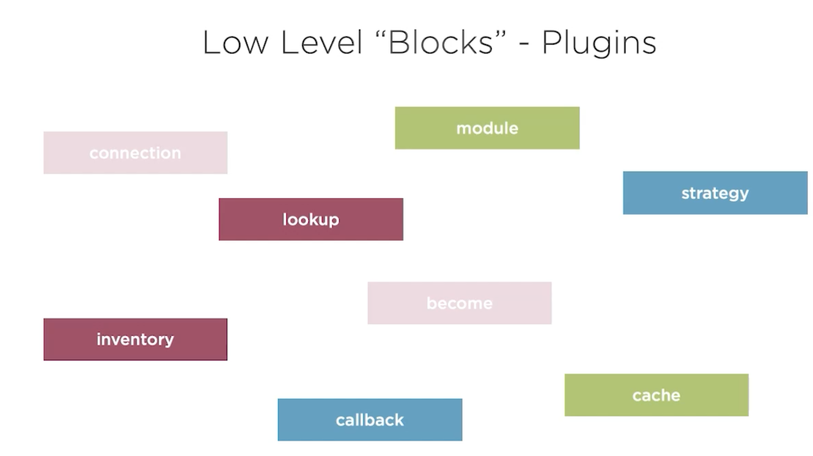
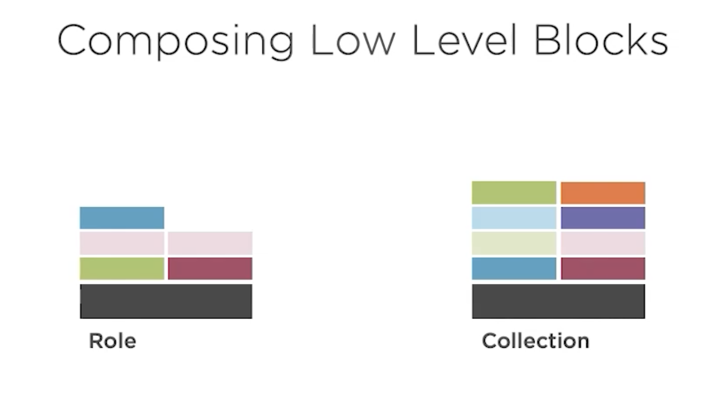

Lower level blocks a.k.a Plugins:


Composing using roles & collections:



***Roles & collections are concept higher than modules and lower than playbooks. Kind of pre-baked libraries achieving very specific set of tasks.***

### Ansible Galaxy


```
ansible-galaxy -h
ansible-galaxy role -h
ansible-galaxy role search git_config
ansible-galaxy collection -h
```


