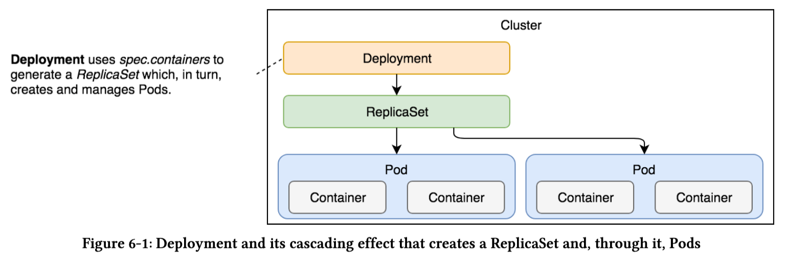
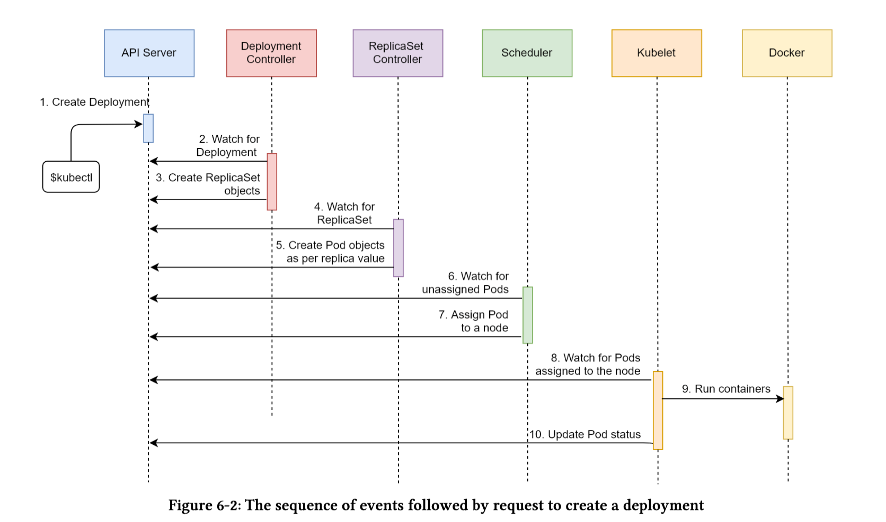

The desired state of our applications is changing all the time. The most common reasons for newstates are new releases. The process is relatively simple. We make a change and commit it to a coderepository. We build it, and we test it. Once we’re confident that it works as expected, we deployit to a cluster. It does not matter whether that deployment is to a development, test, staging, orproduction environment. We need to deploy a new release to a cluster, even when that is a single-node Kubernetes running on a laptop. No matter how many environments we have, the processshould always be the same or, at least, as similar as possible.

## Kubernetes Deployment
Just as we are not supposed to create Pods directly but using other controllers like ReplicaSet, weare not supposed to create ReplicaSets either. Kubernetes Deployments will create them for us.

```
cat deploy/go-demo-2-db.yml

apiVersion: apps/v1
kind: Deployment
metadata:
  name: go-demo-2-db
spec:
  selector:
    matchLabels:
      type: db
      service: go-demo-2
  template:
    metadata:
      labels:
        type: db
        service: go-demo-2
        vendor: MongoLabs
    spec:
      containers:
      - name: db
        image: mongo:3.3
        ports:
        - containerPort: 28017

```

* RS declaration earlier for DB is same as the above. The only differnce is the ***kind***
* We will regularly add --record to the kubectl create commands. This allows us to track each change to our resources such as a Deployments.

```
kubectl create -f deploy/go-demo-2-db.yml --record

kubectl get -f deploy/go-demo-2-db.yml

deployment.apps/go-demo-2-db created
```

* Describing the deployment

```
kubectl describe -f deploy/go-demo-2-db.yml

Name:                   go-demo-2-db
Namespace:              default
CreationTimestamp:      Fri, 31 Jan 2020 03:01:25 +0000
Labels:                 <none>
Annotations:            deployment.kubernetes.io/revision: 1
                        kubernetes.io/change-cause: kubectl create --filename=deploy/go-demo-2-db.yml --record=true
Selector:               service=go-demo-2,type=db
Replicas:               1 desired | 1 updated | 1 total | 1 available | 0 unavailable
StrategyType:           RollingUpdate
MinReadySeconds:        0
RollingUpdateStrategy:  25% max unavailable, 25% max surge
Pod Template:
  Labels:  service=go-demo-2
           type=db
           vendor=MongoLabs
  Containers:
   db:
    Image:        mongo:3.3
    Port:         28017/TCP
    Host Port:    0/TCP
    Environment:  <none>
    Mounts:       <none>
  Volumes:        <none>
Conditions:
  Type           Status  Reason
  ----           ------  ------
  Available      True    MinimumReplicasAvailable
  Progressing    True    NewReplicaSetAvailable
OldReplicaSets:  <none>
NewReplicaSet:   go-demo-2-db-b449d94f (1/1 replicas created)
Events:
  Type    Reason             Age   From                   Message
  ----    ------             ----  ----                   -------
  Normal  ScalingReplicaSet  109s  deployment-controller  Scaled up replica set go-demo-2-db-b449d94f to 1

```

* Upon observing the ***Events*** section we notice the deployment created a ReplicaSet.
* Listing all the objects:

```
kubectl get all

NAME                              READY   STATUS    RESTARTS   AGE
pod/go-demo-2-db-b449d94f-zc6kj   1/1     Running   0          5m4s

NAME                 TYPE        CLUSTER-IP   EXTERNAL-IP   PORT(S)   AGE
service/kubernetes   ClusterIP   10.96.0.1    <none>        443/TCP   23d

NAME                           READY   UP-TO-DATE   AVAILABLE   AGE
deployment.apps/go-demo-2-db   1/1     1            1           5m4s

NAME                                    DESIRED   CURRENT   READY   AGE
replicaset.apps/go-demo-2-db-b449d94f   1         1         1       5m4s
```

* There is no difference between the use of Deployment vs ReplicaSet.

* Real advantage of Deployment is when we try to change of aspect of our deployment.



## Sequence of Events when deploying a Deployment
1. Kubernetes client (kubectl) sent a request to the API server requesting the creation of a Deployment defined in the deploy/go-demo-2-db.yml file.
2. The deployment controller is watching the API server for new events and it detected that there is a new Deployment object.
3. The deployment controller creates a new ReplicaSet object.



## Updating Deployments
Upgrading the Mongo DB to 3.4 version.

```
kubectl set image -f deploy/go-demo-2-db.yml db=mongo:3.5 --record
# db is the name of the container in spec.

Events:
  Type    Reason             Age   From                   Message
  ----    ------             ----  ----                   -------
  Normal  ScalingReplicaSet  26s   deployment-controller  Scaled up replica set go-demo-2-db-84ccb8747 to 1
  Normal  ScalingReplicaSet  18s   deployment-controller  Scaled down replica set go-demo-2-db-b449d94f to 0
```
* We can see that it created a new ReplicaSet and that it scaled the old ReplicaSet to 0. If, in your case,the last line did not appear, you’ll need to wait until the new version of themongoimage is pulled. Instead of operating directly on the level of Pods, the Deployment created a new ReplicaSet which, in turn,produced Pods based on the new image.Once they became fully operational, it scaled the old ReplicaSet to 0. Since we are running a ReplicaSet with only one replica, it might not be clear why it used that strategy. When we create a Deployment for the API, things will become more evident.To be on the safe side, we might want to retrieve all the objects from the cluster.

```

kubectl get all

NAME                               READY   STATUS    RESTARTS   AGE
pod/go-demo-2-db-84ccb8747-jh2b9   1/1     Running   0          118s

NAME                 TYPE        CLUSTER-IP   EXTERNAL-IP   PORT(S)   AGE
service/kubernetes   ClusterIP   10.96.0.1    <none>        443/TCP   23d

NAME                           READY   UP-TO-DATE   AVAILABLE   AGE
deployment.apps/go-demo-2-db   1/1     1            1           7h40m

NAME                                     DESIRED   CURRENT   READY   AGE
replicaset.apps/go-demo-2-db-84ccb8747   1         1         1       118s
replicaset.apps/go-demo-2-db-b449d94f    0         0         0       7h40m

```

### Pod Name hash
* The Pod name is a hash which matches the hash of the ReplicaSet. 84ccb8747
* If we destroy the Deployment and re-create the name would remain the same. Since this is name is derived by hashing the PodTemplate of the ReplicaSet.
* That way Deployment would know if anything related Pods has changed in PodTemplate and if it does would create a new ReplicaSet.
* ***kubctl set image*** command has an alternative. ***kubectl edit***
```
kubectl edit -f deploy/go-demo-2-db.yml
# you’ll need to type:qfollowed by the enter key to exit
```
* ***set iamge** is the better option and also used in CI/CD process.
* Another ***alternative*** is to update the yaml file and do ***apply***

Finishing the database setup by creating the service.
```
kubectl create -f deploy/go-demo-2-db-svc.yml --record
```

## Zero Downtime Deployments
* game of 9's. Atleast 99.99 or even 99.999 percent availability.
* The reason we’re discussing failures and scalability lies in the nature of immutable deployments. If a Pod is unchangeable, the only way to update it with a new release is to destroy the old ones andput the Pods based on the new image in their place.
* Destruction of Pods is not much different from failures. In both cases, they cease to work. On the other hand, fault tolerance (re-scheduling) is areplacement of failed Pods. The only essential difference is that new releases result in Pods being replaced with new ones based on the new image.
* 