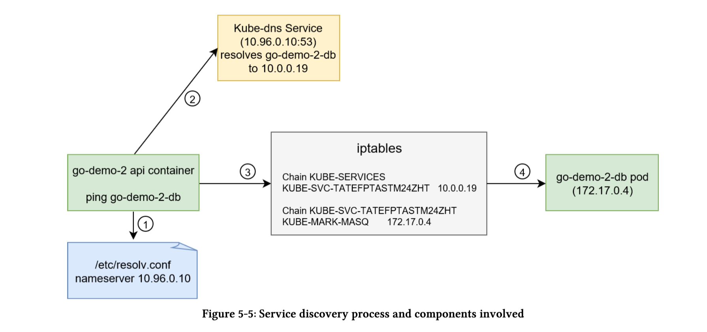
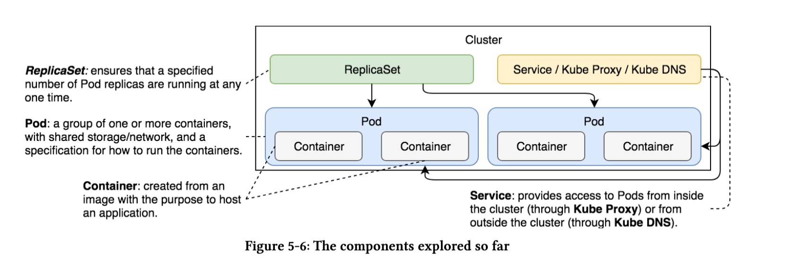

# Discovering services
## Services can be discovered in two ways:
1. ***Environment Variables***
* Every Pod gets environment variables for each of the active Services. They are provided in the sameformat as what Docker links expect, as well with the simpler Kubernetes-specific syntax. So our API pod also has details of all the active services including the DB service.

```
pod_name=$(kubectl get pod --no-headers -o=custom-columns=NAME:.metadata.name -l type=api,service=go-demo-2 | tail -1)

echo $pod_name
go-demo-2-api-hhq2w

kubectl exec $pod_name env

PATH=/usr/local/sbin:/usr/local/bin:/usr/sbin:/usr/bin:/sbin:/bin
HOSTNAME=go-demo-2-api-hhq2w
DB=go-demo-2-db
GO_DEMO_2_DB_SERVICE_PORT=27017
GO_DEMO_2_DB_PORT_27017_TCP_PORT=27017
GO_DEMO_2_API_SERVICE_HOST=10.103.157.214
GO_DEMO_2_API_PORT_8080_TCP=tcp://10.103.157.214:8080
GO_DEMO_2_API_PORT_8080_TCP_ADDR=10.103.157.214
GO_DEMO_2_API_SERVICE_PORT=8080
GO_DEMO_2_API_PORT=tcp://10.103.157.214:8080
GO_DEMO_2_API_PORT_8080_TCP_PROTO=tcp
GO_DEMO_2_DB_PORT=tcp://10.104.120.0:27017
GO_DEMO_2_DB_PORT_27017_TCP_ADDR=10.104.120.0
GO_DEMO_2_DB_PORT_27017_TCP=tcp://10.104.120.0:27017
GO_DEMO_2_DB_SERVICE_HOST=10.104.120.0
GO_DEMO_2_API_PORT_8080_TCP_PORT=8080
GO_DEMO_2_DB_PORT_27017_TCP_PROTO=tcp
KUBERNETES_SERVICE_PORT_HTTPS=443
KUBERNETES_PORT_443_TCP_ADDR=10.96.0.1
KUBERNETES_PORT_443_TCP_PORT=443
KUBERNETES_PORT_443_TCP=tcp://10.96.0.1:443
KUBERNETES_SERVICE_HOST=10.96.0.1
KUBERNETES_SERVICE_PORT=443
KUBERNETES_PORT_443_TCP_PROTO=tcp
KUBERNETES_PORT=tcp://10.96.0.1:443
HOME=/root
```
* The first five variables areusing the Docker format. If you already worked with Docker networking,you should be familiar with them. At least, if you’re familiar with the way Swarm (standalone) and Docker Compose operate. Later version of Swarm (Mode) still generate the environment variables but they are mostly abandoned by the users in favour of DNSes.

* The last few environment variables are Kubernetes specific and follow the [SERVICE_NAME]_-SERVICE_HOST and[SERVICE_NAME]_SERIVCE_PORT format (service name is upper-cased). No matter which set of environment variables you choose to use (if any), they all serve the same purpose. They provide a reference we can use to connect to a Service and, therefore to the related Pods.

* Things will become more evident when we describe thego-demo-2-dbService.

```
kubectl describe svc go-demo-2-db

Name:              go-demo-2-db
Namespace:         default
Labels:            <none>
Annotations:       <none>
Selector:          service=go-demo-2,type=db
Type:              ClusterIP
IP:                10.104.120.0
Port:              <unset>  27017/TCP
TargetPort:        27017/TCP
Endpoints:         10.244.1.20:27017
Session Affinity:  None
Events:            <none>
```

* The IP field above matches with the API pods environment variables.
```
GO_DEMO_2_DB_PORT=tcp://10.104.120.0:27017
GO_DEMO_2_DB_PORT_27017_TCP_ADDR=10.104.120.0
GO_DEMO_2_DB_PORT_27017_TCP=tcp://10.104.120.0:27017
GO_DEMO_2_DB_SERVICE_HOST=10.104.120.0
```

* We could have implemented our API to read GO_DEMO_2_DB_SERVICE_HOST & GO_DEMO_2_DB_PORT to form the connection string to DB.

2. ***DNS***
* it is easier to use DNS.
```
cat svc/go-demo-2-api-rs.yml

env:
    - name: DB
    value: go-demo-2-db
```
* We declared an environment variable with the name of the Service (go-demo-2-db). That variableis used by the code as a connection string to the database. Kubernetes converts Service names intoDNSes and adds them to the DNS server. It is a cluster add-on that is already set up in our Cluster.
* Sequence of events:
    * When the api container go-demo-2 tries to connect with the go-demo-2-db Service, it looks at the nameserver configured in /etc/resolv.conf.kubelet configured the nameserver with the kube-dns Service IP (10.96.0.10) during the Pod scheduling process.
    * The container queries the DNS server listening to port 53.go-demo-2-dbDNS gets resolved tothe service IP10.0.0.19. This DNS record was added by kube-dns during the service creation process.
    * The container uses the service IP which forwards requests through the iptables rules. Theywere added by kube-proxy during Service and Endpoint creation process.
    * Since we only have one replica of the go-demo-2-dbPod, iptables forwards requests to just one endpoint. If we had multiple replicas, iptables would act as a load balancer and forward requests randomly among Endpoints of the Service.
    
    

## Conclusion
Services are indispensable objects without which communication between Pods would be hard andvolatile. They provide static addresses through which we can access them not only from other Podsbut also from outside the cluster. This ability to have fixed entry points is crucial as it providesstability to otherwise dynamic elements of the cluster. Pods come and go, Services stay