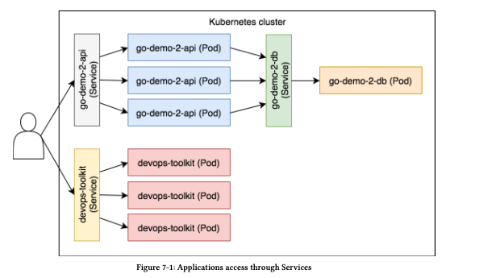

Ingress objects manage external access to the applications running within the Kubernetes clusters. We would need features like ***forwarding rules*** on paths and domains and ***SSL termination***

A tradiotinal setup would probably have a external load balancer or a proxy. ***Ingress*** provides an API to do all these things and other features that would be required for  a dynamic cluster.

## Exposing defeciences with access using Kubernetes Services

* With just services we need to know the port where the app is listening. For end user that wouldn't be a good user experience.

```
curl localhost:31961/demo/hello
hello, world!
```

* Creating the setup first:

```
kubectl create -f ingress/go-demo-2-deploy.yml 

deployment.apps/go-demo-2-db created
service/go-demo-2-db created
deployment.apps/go-demo-2-api created
service/go-demo-2-api created

kubectl get -f ingress/go-demo-2-deploy.yml

NAME                           READY   UP-TO-DATE   AVAILABLE   AGE
deployment.apps/go-demo-2-db   1/1     1            1           41s

NAME                   TYPE        CLUSTER-IP     EXTERNAL-IP   PORT(S)     AGE
service/go-demo-2-db   ClusterIP   10.98.219.81   <none>        27017/TCP   41s

NAME                            READY   UP-TO-DATE   AVAILABLE   AGE
deployment.apps/go-demo-2-api   3/3     3            3           41s

NAME                    TYPE       CLUSTER-IP       EXTERNAL-IP   PORT(S)          AGE
service/go-demo-2-api   NodePort   10.107.125.129   <none>        8080:31444/TCP   40s

kubectl get pods

NAME                             READY   STATUS    RESTARTS   AGE
go-demo-2-api-86469df75d-jqt7c   1/1     Running   0          2m13s
go-demo-2-api-86469df75d-ll9sg   1/1     Running   0          2m12s
go-demo-2-api-86469df75d-ql8gz   1/1     Running   0          2m12s
go-demo-2-db-5bfdb95844-zdlsj    1/1     Running   0          2m13s

```

* Now to access the services this our option:

```
PORT=$(kubectl get svc go-demo-2-api -o jsonpath="{.spec.ports[0].nodePort}")

echo $PORT
31444

curl -i "http://localhost:$PORT/demo/hello"
HTTP/1.1 200 OK
Date: Fri, 07 Feb 2020 15:37:46 GMT
Content-Length: 14
Content-Type: text/plain; charset=utf-8

hello, world!
```

* This approach might not look to be a bad option with One App. To increase the issue we will deploy one more app:

```
kubectl create -f ingress/devops-toolkit-dep.yml --record --save-config

deployment.apps/devops-toolkit created
service/devops-toolkit created

kubectl get -f ingress/devops-toolkit-dep.yml

NAME                             READY   UP-TO-DATE   AVAILABLE   AGE
deployment.apps/devops-toolkit   3/3     3            3           83s

NAME                     TYPE       CLUSTER-IP     EXTERNAL-IP   PORT(S)        AGE
service/devops-toolkit   NodePort   10.104.41.21   <none>        80:30714/TCP   83s

PORT=$(kubectl get svc devops-toolkit -o jsonpath="{.spec.ports[0].nodePort}")

echo $PORT
30714

curl -i "http://localhost:$PORT"

```

* So we got a new PORT for the new App.



A user sends a request to one of the nodes of the cluster. That request is received by a Service and load balanced to one of the associated Pods. It’s a bit more complicated than that, with iptables, kube DNS, kube proxy, and a few other things involved in the process.

## What is the ideal setup?

* There should a single route without port. Something like this:

```
for the hello app ->
curl "http://$IP/demo/hello"

for the devopstookit api ->

curl -H "Host: devopstoolkitseries.com" http://localhost
curl: (7) Failed to connect to localhost port 80: Connection refused

```
* Still doesn't work. So Services can give what we need.
* Last,but not least, we should be able to make some, if not all, applications(partly) secure by enabling HTTPS access. That means that we should have a place to store our SSL certificates. We could put them inside our  applications, but that would only increase the operational complexity. Instead, weshould aim towards SSL offloading somewhere between clients and the applications, and it should come as no surprise that Kubernetes has a solution for all these.

## Enabling Ingress Controllers

* We need a mechanism that will accept requests on pre-defined ports (e.g.,80 and 443) and forward them to Kubernetes Services. It should be able to distinguish requests based on paths and domains as well as to be able to perform SSL offloading.
* Out of the Box Kubernetes does not have a solution for Ingress Controllers. The Controllers that come in built in the kube-controller-manager library doesn't have support for Ingress.
* Instead of the Controller, kube-controller-manager offers a ***Ingress Resource*** that other third-party solutions can can utilize to provide requests forwarding and SSL features. In other words, Kubernetes only provides an API, and we need to set up a Controller that will use it.

* Setting up the NGINX Ingress Controller on bare metal:

```
# installting the Controller
kubectl apply -f https://raw.githubusercontent.com/kubernetes/ingress-nginx/nginx-0.28.0/deploy/static/mandatory.yaml (this one has a bug. the nginx pod was always pending)

https://raw.githubusercontent.com/kubernetes/ingress-nginx/master/deploy/static/mandatory.yaml (use this one)

# starting the service

kubectl apply -f https://raw.githubusercontent.com/kubernetes/ingress-nginx/nginx-0.28.0/deploy/static/provider/baremetal/service-nodeport.yaml

To verify:
kubectl get all --namespace ingress-nginx
```

By default, the Ingress Controller is configured with only two endpoints.

```
Got the IP by listing using "get all" in this ingress-nginx namespace

curl -i "http://10.99.181.61/healthz"

HTTP/1.1 200 OK
Server: nginx/1.17.8
Date: Fri, 21 Feb 2020 14:16:31 GMT
Content-Type: text/html
Content-Length: 0
Connection: keep-alive

curl -i "http://10.99.181.61/something"
HTTP/1.1 404 Not Found
Server: nginx/1.17.8
Date: Fri, 21 Feb 2020 14:16:57 GMT
Content-Type: text/html
Content-Length: 153
Connection: keep-alive

<html>
<head><title>404 Not Found</title></head>
<body>
<center><h1>404 Not Found</h1></center>
<hr><center>nginx/1.17.8</center>
</body>
</html>
```

## Creating Ingress Resource based on paths

Now that we have the Nginx Controller setup, will now make the go-demo-2-api on a path /demo on port 80.
So no longer would we need to know the port to access the api.

```
cat ingress/go-demo-2-ingress.yml

apiVersion: extensions/v1beta1
kind: Ingress
metadata:
  name: go-demo-2
  annotations:
    kubernetes.io/ingress.class: "nginx"
    ingress.kubernetes.io/ssl-redirect: "false"
    nginx.ingress.kubernetes.io/ssl-redirect: "false"
spec:
  rules:
  - http:
      paths:
      - path: /demo
        backend:
          serviceName: go-demo-2-api
          servicePort: 8080
```

* The annotations section allows us to provide additional information to the IngressController. As you’ll see soon,Ingress API specification is concise and limited. That is done on purpose.The specification API defines only the fields that are mandatory for all IngressControllers. All the additional info an IngressController needs is specified through annotations. That way, the community behind the Controllers can progress at great speed,while still providing basic general compatibility and standards.

https://github.com/kubernetes/ingress-nginx/blob/master/docs/user-guide/nginx-configuration/annotations.md

* We specified only one ***annotation.nginx.ingress.kubernetes.io/ssl-redirect: "false"*** tells the Controller that we do NOT want to redirect all HTTP requests to HTTPS. We’re forced to do so since we do not have SSL certificates for the exercises that follow.

* We specified a set of ***rules*** in the ***spec*** section. They are used to configure Ingress resource. For now, our rule is based on ***http*** with a single path and a ***backend***. All the requests with the ***path*** starting with ***/demo*** will be forwarded to the service ***go-demo-2-api*** on the port ***8080***.

* Now lets go ahead and deploy the resources:

```
kubectl create -f ingress/go-demo-2-ingress.yml 
ingress.extensions/go-demo-2 created

kubectl describe -f ingress/go-demo-2-ingress.yml

Name:             go-demo-2
Namespace:        default
Address:          10.99.181.61
Default backend:  default-http-backend:80 (<none>)
Rules:
  Host  Path  Backends
  ----  ----  --------
  *     
        /demo   go-demo-2-api:8080 (<none>)
Annotations:
  kubernetes.io/ingress.class:               nginx
  nginx.ingress.kubernetes.io/ssl-redirect:  false
  ingress.kubernetes.io/ssl-redirect:        false
Events:
  Type    Reason  Age   From                      Message
  ----    ------  ----  ----                      -------
  Normal  CREATE  47s   nginx-ingress-controller  Ingress default/go-demo-2
  Normal  UPDATE  41s   nginx-ingress-controller  Ingress default/go-demo-2

kubectl get -f ingress/go-demo-2-ingress.yml

NAME        HOSTS   ADDRESS        PORTS   AGE
go-demo-2   *       10.99.181.61   80      103s
```

* Now lets verify if we can access our go-demo-2-api using the path /demo
```
curl -i "http://10.99.181.61/demo/hello"
HTTP/1.1 200 OK
Server: nginx/1.17.8
Date: Fri, 21 Feb 2020 15:04:36 GMT
Content-Type: text/plain; charset=utf-8
Content-Length: 14
Connection: keep-alive

hello, world!
```

* There is still a problem with our setup here. The go-demo-2 Service we’re currently using is no longer properly configured for our Ingress setup.

Our service is currently exposed on ***8080*** which is not required anymore:

```
kubectl describe svc go-demo-2-api

Name:                     go-demo-2-api
Namespace:                default
Labels:                   <none>
Annotations:              <none>
Selector:                 service=go-demo-2,type=api
Type:                     NodePort
IP:                       10.111.193.158
Port:                     <unset>  8080/TCP
TargetPort:               8080/TCP
NodePort:                 <unset>  31434/TCP
Endpoints:                10.244.1.91:8080,10.244.1.92:8080,10.244.2.73:8080
Session Affinity:         None
External Traffic Policy:  Cluster
Events:                   <none>

curl -i "http://10.111.193.158:8080/demo/hello"

HTTP/1.1 200 OK
Date: Fri, 21 Feb 2020 15:08:38 GMT
Content-Length: 14
Content-Type: text/plain; charset=utf-8

hello, world!
```

* Using ***type: NodePort,*** it is configured to export the port ***8080*** on all of the nodes. Since we’re expecting users to access the application through the Ingress Controller on port ***80***, there’s probably no need to allow external access through the port ***8080*** as well. We should switch to the ***ClusterIP*** type. That will allow direct access to the Service only within the cluster, thus limiting all external communication through Ingress.