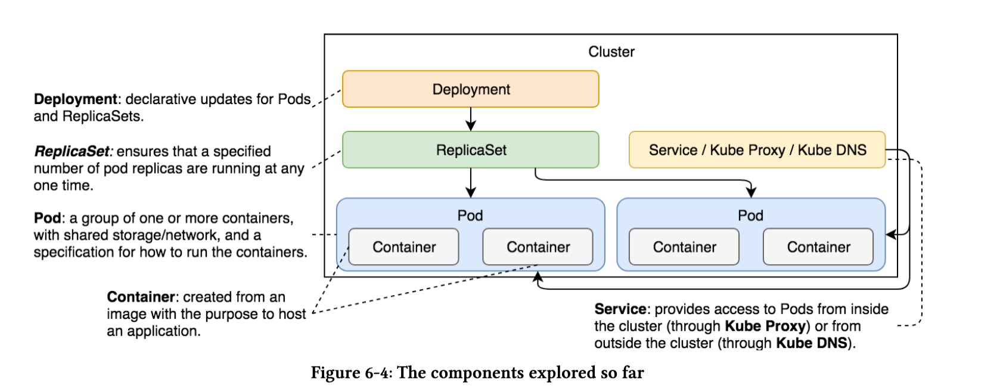

There are quite a few different ways we can scale Deployments. Everything we do in this section isnot unique to Deployments and can be applied to any Controller, like ReplicaSet, and those we didnot yet explore.If we decide that the number of replicas changes with relatively low frequency or that Deploymentsare performed manually, the best way to scale is to write a new YAML file or, even better, modifythe existing one. Assuming that we store YAML files in a code repository, by updating existing files we have a documented and reproducible definition of the objects running inside a cluster. We already performed scaling when we applied the definition from the go-demo-2-scaled.yml.We’lldo something similar, but with Deployments.Let’s take a look at deploy/go-demo-2-scaled.yml.

```
cat deploy/go-demo-2-scaled.yml 

apiVersion: apps/v1
kind: Deployment
metadata:
  name: go-demo-2-api
spec:
  replicas: 5
```
The only change above is the number of replicas.

At the moment, we’re running three replicas. Once we apply the new definition, it should increaseto five.

```
kubectl apply -f deploy/go-demo-2-scaled.yml 
deployment.apps/go-demo-2-db configured
service/go-demo-2-db unchanged
deployment.apps/go-demo-2-api configured
service/go-demo-2-api unchanged
```

Only the number of replicas for API has changed to 5
```
kubectl get -f deploy/go-demo-2-scaled.yml 
NAME                           READY   UP-TO-DATE   AVAILABLE   AGE
deployment.apps/go-demo-2-db   1/1     1            1           3h30m

NAME                   TYPE        CLUSTER-IP       EXTERNAL-IP   PORT(S)     AGE
service/go-demo-2-db   ClusterIP   10.108.117.208   <none>        27017/TCP   3h30m

NAME                            READY   UP-TO-DATE   AVAILABLE   AGE
deployment.apps/go-demo-2-api   5/5     5            5           3h30m

NAME                    TYPE       CLUSTER-IP      EXTERNAL-IP   PORT(S)          AGE
service/go-demo-2-api   NodePort   10.102.66.248   <none>        8080:31961/TCP   3h30m
```

The result should come as no surprise. After all, we executed the same process before, when weexplored ReplicaSets.While scaling Deployments using YAML files (or other Controllers) is an excellent way to keep documentation accurate, it rarely fits the dynamic nature of the clusters. We should aim for a system that will scale(and de-scale)services automatically. When scaling is frequent and,hopefully,automated, we cannot expect to update YAML definitions and push them to Git. That would be too inefficient and would probably cause quite a few unwanted executions of delivery pipelines if theyare triggered through repository WebHooks. After all, do we really want to push updated YAMLfiles multiple times a day?

***The number of replicas should not be part of the design. Instead, they are a fluctuating number that changes continuously (or at least often), depending on the traffic, memory and CPU utilization, and so on.***

Depending on release frequency, the same can be said for image. If we are practicing continuous delivery or deployment, we might be releasing once a week, once a day, or even more often. In such cases, new images would be deployed often, and there is no strong argument for the need to change YAML files every time we make a new release. That is especially true if we are deploying through an automated process (as we should).We’ll explore automation later on. For now, we’ll limit ourselves to a command similar to ***kubectl set image***. We used it to change the image used by Pods with each release. Similarly, we’ll use ***kubectl scale*** to change the number of replicas. Consider this an introduction to automation that is coming later on.

```
kubectl scale deployment go-demo-2-api --replicas 8 --record
deployment.extensions/go-demo-2-api scaled

kubectl get -f deploy/go-demo-2.yml
NAME                            READY   UP-TO-DATE   AVAILABLE   AGE
deployment.apps/go-demo-2-api   8/8     8            8           3h40m
```


