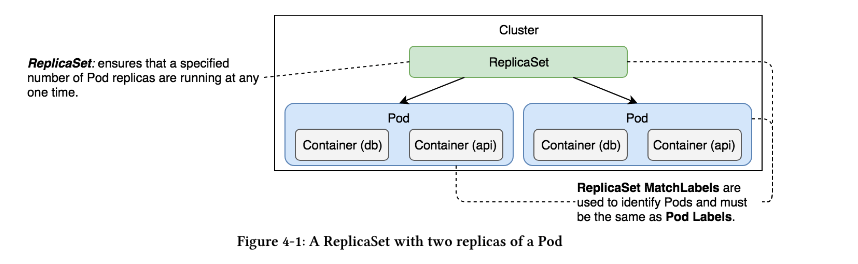
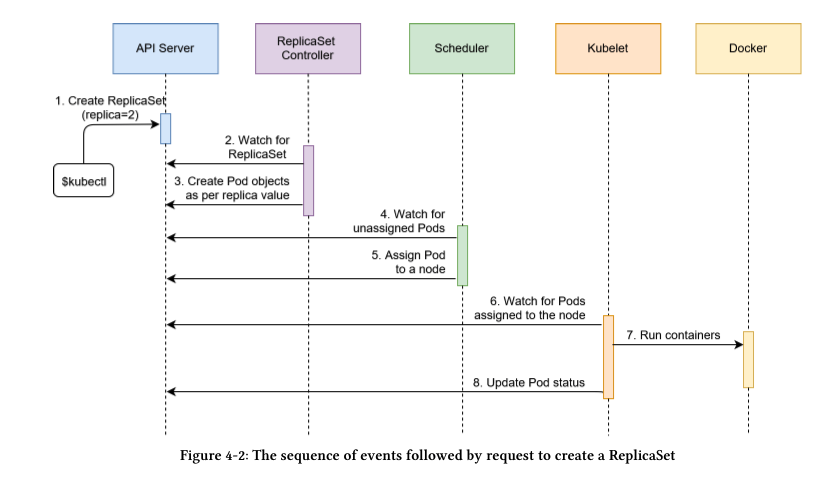
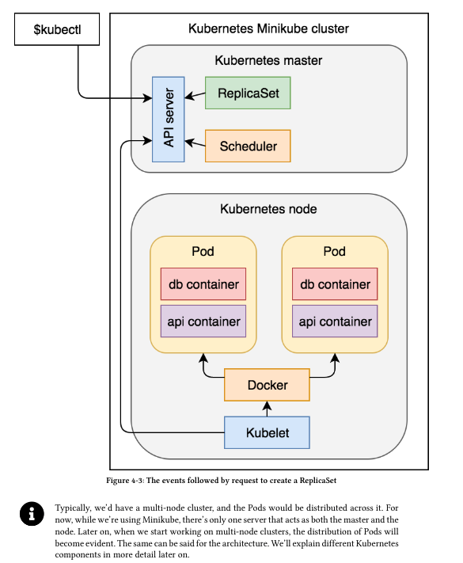

# Scaling Pods with ReplicaSets

* Its primary, and pretty much only function, is to ensure that a specified number of replicas of a Pod matches the actual state (almost) all the time.
*  ReplicaSets make Pods scalable
* We can think of ReplicaSets as a self-healing mechanism. As long as elementary conditions are met (e.g., enough memory and CPU), Pods associated with a ReplicaSet are guaranteed to run. They provide fault-tolerance and high availability.
* ReplicaSet is the next-generation ReplicationController. ReplicaSet has support for selectors and ReplicationControllers didn't.

## Creating a ReplicaSet
```
apiVersion:  apps/v1
kind: ReplicaSet
metadata: 
  name: go-demo-2
spec:
  replicas: 2
  selector:
  matchLabels:
      type: backend
      service: go-demo-2
  template:
    metadata:
      labels:
        type: backend
        service: go-demo-2
        db: mongo
        language: go
    spec:
      containers:
      - name: db
        image: mongo:3.3
      - name: api
        image: vfarcic/go-demo-2
        env:
        - name: DB
          value: localhost
        livenessProbe:
          httpGet:
            path: /demo/hello
            port: 8080
```

* apiVersion: Mandatory with all Kubernetes Objects
* kind: Mandatory with all Kubernetes Objects - and this time it is ReplicaSet instead of a Pod
* metedata: Mandatory with all Kubernetes Objects - This is key value pair for informational purpose only. Doesn't affect behavior.
* spec.replicas: defaults to 1. Specifying 2 means two Pods would be run concurrently.
* selector: This selects which Pods should be included in this ReplicaSet. It doesn't distinguish between Pods created by a ReplicaSet or someother process. That way ReplicaSet and Pods are decoupled. If the Pods matching the ReplicaSet selector already exists. ReplicaSet would do nothing. It would monitor for desired state, if not avaibale will converge to it.
* We used spec.selector.matchLabels to specify a few labels. They must match the labels defined in the spec.template. In our    case, ReplicaSet will look for Pods with type set to backend and service set to go-demo-2. If Pods with those labels do not already exisit it will create them using the spec.template section.
* template.metadata : It is the only required field in the spec,and it has the same schema as a Pod specification. At a minimum the labels of the spec.template.metadata.labels section must match those specified in the spec.selector.matchLabels. We can set additional labels that will serve informational purposes only. ReplicaSet will make sure that the number of replicas matches the number of Pods with the same labels. In our case, we set type and service to the same values and added two additional ones (dbandlanguage)
* spec.template.spec.containers: Is mandatory. ReplicaSet would look for Pods with matching labels type: backendandservice: go-demo-2. If they were created by other means and matches the count, ReplicaSet would do nothing. If not available will create them.
* containers: Section is same as Pod yaml file.

```
kubectl create -f rs/go-demo-2.yml
kubectl get rs
NAME        DESIRED   CURRENT   READY   AGE
go-demo-2   2         2         2       41s

Instead fetching all replicas. Use this to get the ones we need:

kubectl get -f rs/go-demo-2.yml
kubectl describe -f rs/go-demo-2.yml
kubectl get pods --show-labels

NAME              READY   STATUS    RESTARTS   AGE     LABELS
go-demo-2-dsz6h   2/2     Running   0          4m13s   db=mongo,language=go,service=go-demo-2,type=backend
go-demo-2-n758v   2/2     Running   0          4m13s   db=mongo,language=go,service=go-demo-2,type=backend

```



Following are the events that happened after we issued the RS create command:
1. Kubernetes client (kubectl) sent a request to the API server requesting the creation of a ReplicaSet defined in thers/go-demo-2.ymlfile.

2. The controller is watching the API server for new events, and it detected that there is a new ReplicaSet object.

3. The controller creates two new pod definitions because we have configured replica value as 2inrs/go-demo-2.ymlfile.

4. Since the scheduler is watching the API server for new events, it detected that there are two unassigned Pods .

5. The scheduler decided to which node to assign the Pod and sent that information to the APIserver.

6. Kubelet is also watching the API server. It detected that the two Pods were assigned to the node it is running on.

7. Kubelet sent requests to Docker requesting the creation of the containers that form the Pod.In our case, the Pod defines two containers based on the mongo and api image. So in total four containers are created.

8. Finally, Kubelet sent a request to the API server notifying it that the Pods were created successfully.Figure 4-2: The sequence of events followed by request to create a ReplicaSetThe sequence we described is useful when we want to understand everything that happened in thecluster from the moment we requested the creation of a new ReplicaSet. However, it might be tooconfusing so we’ll try to explain the same process through a diagram that more closely representsthe cluster.






## How to Operate a ReplicaSet

ReplicaSet is loosely coupled with the Pods. So we can delete just the ReplicaSet and keep the Pods running.

```
kubectl delete -f rs/go-demo-2.yml --cascade=false
```

* cascade=false : Does the trick of only deleting the rs and leaving the pods behind.

Now when we list the Pods, we still find them. So we just deleted the relationship between RS and the Pods.

```
kubectl get pods
NAME              READY   STATUS    RESTARTS   AGE
go-demo-2-c4ccl   2/2     Running   0          31s
go-demo-2-f5dvh   2/2     Running   0          31s
```

```
kubectl create -f rs/go-demo-2.yml --save-config
```
save-config: saves the configuration. will be used later.

* Now we created a new ReplicaSet and mapped it with the existing pods. Also we can verify the Pod labels by.
```
kubectl get pods --show-labels
```
* ***crearte*** vs ***apply*** : Apply saves the configuration automatically, so that we can edit later on. For create we had to use --save-config additionally.

* Scaling the ReplicaSet: Notice the output says configured.
```
kubectl apply -f rs/go-demo-2-scaled.yml 
replicaset.apps/go-demo-2 configured
```
* The only difference with go-demo-2 was number of replicas:
```
spec:
  replicas: 4
```
* Testing self healing:

```
POD_NAME=$(kubectl get pods -o name | tail -1)

kubectl delete $POD_NAME
pod "go-demo-2-hll8r" deleted

kubectl get pods --show-labels
NAME              READY   STATUS    RESTARTS   AGE     LABELS
go-demo-2-95zk8   2/2     Running   0          4m45s   db=mongo,language=go,service=go-demo-2,type=backend
go-demo-2-c4ccl   2/2     Running   0          13m     db=mongo,language=go,service=go-demo-2,type=backend
go-demo-2-f5dvh   2/2     Running   0          13m     db=mongo,language=go,service=go-demo-2,type=backend
go-demo-2-vgkwj   2/2     Running   0          16s     db=mongo,language=go,service=go-demo-2,type=backend

```

* Lets verify the importance of ***labels*** Let’s see what happens if we remove one of the Pod labels ReplicaSet uses in its selector.

```
POD_NAME=$(kubectl get pods -o name | tail -1)
kubectl label $POD_NAME service -
kubectl describe $POD_NAME

Labels:    
    db=mongo
    language=go
    type=backend


kubectl get pods --show-labels
NAME              READY   STATUS    RESTARTS   AGE     LABELS
go-demo-2-95zk8   2/2     Running   0          11m     db=mongo,language=go,service=go-demo-2,type=backend
go-demo-2-c4ccl   2/2     Running   0          20m     db=mongo,language=go,service=go-demo-2,type=backend
go-demo-2-f5dvh   2/2     Running   0          20m     db=mongo,language=go,service=go-demo-2,type=backend
go-demo-2-j2x8b   2/2     Running   0          2m25s   db=mongo,language=go,service=go-demo-2,type=backend
go-demo-2-vgkwj   2/2     Running   0          6m53s   db=mongo,language=go,type=backend

```

* Notice service label has been removed. And how an New Pod was spun up. Since ReplicaSet found a missing Pod (becoz of no label match), it created one.

* If we add back the label. Rs would remove the extra Pod.

```
kubectl label $POD_NAME service=go-demo-2
pod/go-demo-2-vgkwj labeled

kubectl get pods --show-labels
NAME              READY   STATUS    RESTARTS   AGE   LABELS
go-demo-2-95zk8   2/2     Running   0          15m   db=mongo,language=go,service=go-demo-2,type=backend
go-demo-2-c4ccl   2/2     Running   0          24m   db=mongo,language=go,service=go-demo-2,type=backend
go-demo-2-f5dvh   2/2     Running   0          24m   db=mongo,language=go,service=go-demo-2,type=backend
go-demo-2-vgkwj   2/2     Running   0          10m   db=mongo,language=go,service=go-demo-2,type=backend
```

* count is now back to 4.

* ***ReplicaSets*** are almost never used by themselves. Just as we don't create Pods directly. Instead, we tend to create ReplicaSets through Deployments. In other words, we use ReplicaSets to create and control Pods, and Deployments to create ReplicaSets (and a few other things).