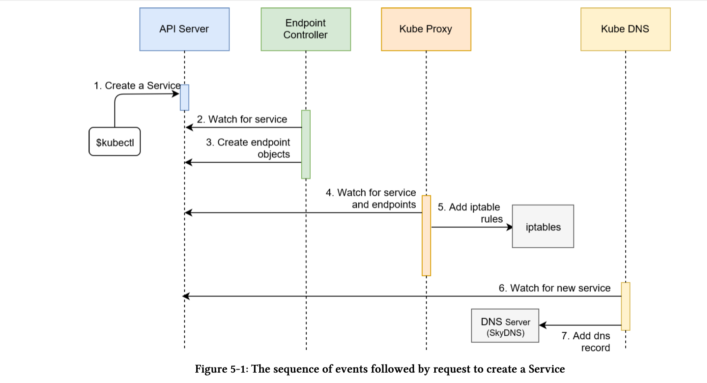
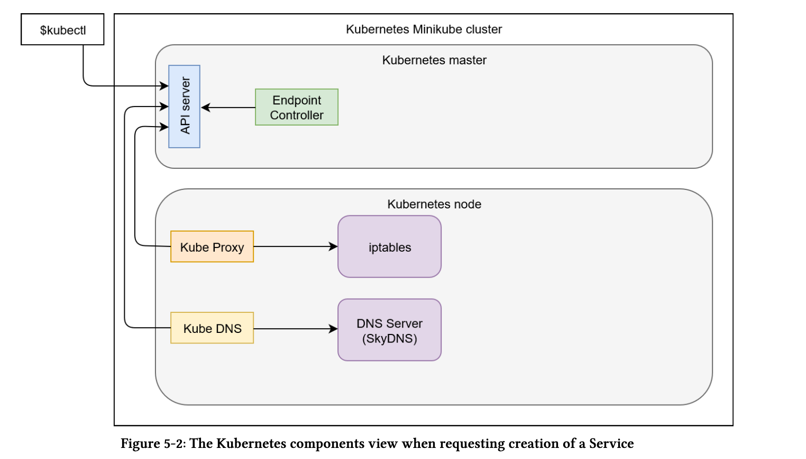
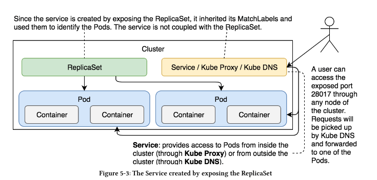

# Using Services for Pod communication
* Pods are born and they die. Never healed. New ones added and surplus ones killed.
* Controllers together with other components like Scheduler make sure that the Pods are doing the right thing. Controllers control the schedulers.
* Previous setup in [Scaling with Pods](/dtk-2.3/scaling-with-pods), had a issue. Both the API and DB containers were in the same Pod. That restricts scaling. One cannot scale without the other. And communication was happening via localhost.
* To split them up, will have to take care of communication.
* Need for Services:
    * We can spilt the API and DB into separate Pods.
    * Pods get their own IP address. But since Pods are short lived, their IP adress also cannot be relied on.
    * We need a stable never to be changed IP adress that forwards the requests to whichever Pod is currently running and can take the request.
    * ***Services*** fulfill that requirement:

        ```
            - name: db
                image: mongo:3.3
                command: ["mongod"]
                args: ["--rest","--httpinterface"]
                ports:
                    - containerPort: 28017
                    protocol: TCP
        ```

* We customized the command and the arguments so that the Mongo DB exposes the REST interface. We also defined the containerPort. This will allow us to access the database through a service.

* Now using ***kubectl expose*** command we will expose the ReplicaSet as a Kubenetes service.
Other Kubernetes objects like Deployment, another Service, Pods can also be exposed in a similar way.

```
kubectl expose rs go-demo-2 \
--name=go-demo-2-svc \
--target-port=28017 \
--type=NodePort
```

* We are exposing a ReplicaSet named ***go-demo-2*** and createing the service with name ***go-demo-2-svc*** , port to be exposed is ***28017*** since MongoDb would be listening to it. Type would be ***NodePort***, which means this port would be exposed on every node in the cluster and the request would be routed to one of the Pods controlled by the ReplicaSet.

* Other types of Services:
    * ClusterIP (default type): Exposes port only within the cluster. No external access.
    When we created NodePort, ClusterIP was also created.
    * LoadBalancer: This used with cloud providers load balancer.
* Events that happens with Service:
    1. Kubernetes client (kubectl) sent a request to the API server requesting the creation of the Service based on Pods created through the go-demo-2 ReplicaSet.
    2. Endpoint controller is watching the API server for new service events. It detected that there is a new Service object.
    3. Endpoint controller created endpoint objects with the same name as the Service, and it used Service selector to identify endpoints (in this case the IP and the port of go-demo-2 Pods).
    4. kube-proxy is watching for service and endpoint objects. It detected that there is a new Service and a new endpoint object.
    5. kube-proxy added iptables rules which capture traffic to the Service port and redirect it to endpoints. For each endpoint object, it adds iptables rule which selects a Pod.
    6. The kube-dns add-on is watching for Service. It detected that there is a new service.
    7. The kube-dns added db’s record to the dns server (skydns).




```
kubectl describe svc go-demo-2-svc

Name:                     go-demo-2-svc
Namespace:                default
Labels:                   <none>
Annotations:              <none>
Selector:                 service=go-demo-2,type=backend
Type:                     NodePort
IP:                       10.101.135.25
Port:                     <unset>  28017/TCP
TargetPort:               28017/TCP
NodePort:                 <unset>  30326/TCP
Endpoints:                10.244.1.10:28017,10.244.2.8:28017
Session Affinity:         None
External Traffic Policy:  Cluster
Events:                   <none>
```

* Since the Service is associated with the Pods created through the ReplicaSet, it inherited all their labels. The selector matches the one from the ReplicaSet. The Service is not directly associated with the ReplicaSet (or any other controller) but with Pods through matching labels.

```
PORT=$(kubectl get svc go-demo-2-svc -ojsonpath="{.spec.ports[0].nodePort}")
```

* Next is the Node Port type which exposes ports to all the nodes. Since Node Port automatically created Cluster IP type as well,all the Pods in the cluster can access the TargetPort. The Port is set to 28017.That is the port that the Pods can use to access the Service. Since we did not specify it explicitly when we executed the command, its value is the same as the value of theTargetPort, which is the portof the associated Pod that will receive all the requests.NodePortwas generated automatically sincewe did not set it explicitly. It is the port which we can use to access the Service and, therefore, thePods from outside the cluster. In most cases, it should be randomly generated, that way we avoid any clashes.



## Declarative approach is creating Services

* Clean up before we start:
    ```
    kubectl delete svc go-demo-2-svc
    ```
* Declarative service creation:
    ```
    cat svc/go-demo-2-svc.yml 

    apiVersion: v1
    kind: Service
    metadata:
    name: go-demo-2
    spec:
        type: NodePort
        ports:
        - port: 28017
            nodePort: 30001
            protocol: TCP
        selector:
            type: backend
            service: go-demo-2
    ```
* The type of the Service is set to ***NodePort*** meaning that the ports will be available both within the cluster as well as from outside by sending requests to any of the nodes.
* The ***ports*** section specifies that the requests should be forwarded to the Pods on port ***28017***. 
* The ***nodePort*** is new. Instead of letting the service expose a random port, we set it to the explicit value of ***30001***. Even though, in most cases, that ***is not a good practice**, we are doing it for demonstration purposes. 
* The protocol is set to ***TCP***. The only other alternative would be to use UDP. TCP is default. Cloud have skipped declaring.
* The ***selector*** is used by the Service to know which Pods should receive requests. It works in the same way as ReplicaSet selectors. In this case, we defined that the service should forward requeststo Pods with labels typeset to backend and service set to go-demo. Those two labels are set in the Pods spec of the ReplicaSet.

* Now creating the service:
```
    kubectl create -f svc/go-demo-2-svc.yml

    kubectl get -f svc/go-demo-2-svc.yml

    output ->

    NAME        TYPE       CLUSTER-IP      EXTERNAL-IP   PORT(S)           AGE
    go-demo-2   NodePort   10.108.186.40   <none>        28017:30001/TCP   41s

    kubectl get ep go-demo-2 -o yaml

    output->

    apiVersion: v1
    kind: Endpoints
    metadata:
    creationTimestamp: "2020-01-27T15:06:15Z"
    name: go-demo-2
    namespace: default
    resourceVersion: "241757"
    selfLink: /api/v1/namespaces/default/endpoints/go-demo-2
    uid: 901a8a9c-4116-11ea-853b-02a6959db9c2
    subsets:
    - addresses:
    - ip: 172.244.1.11
        nodeName: anirban2c.example.com
        targetRef:
        kind: Pod
        name: go-demo-2-cwkgv
        namespace: default
        resourceVersion: "238142"
        uid: 5778f674-4059-11ea-8c7a-02a6959db9c2
    - ip: 172.244.2.9
        nodeName: anirban3c.example.com
        targetRef:
        kind: Pod
        name: go-demo-2-5gxzc
        namespace: default
        resourceVersion: "238149"
        uid: 57788718-4059-11ea-8c7a-02a6959db9c2
    ports:
    - port: 28017
        protocol: TCP
```

* We can see that there are two subsets, corresponding to the two Pods that contain the same labels asthe Service selector. Each has a unique IP that is included in the algorithm used when forwarding requests. Actually,it’s notmuch of an algorithm. Requests will be sent to those Pods randomly.Thatrandomness results in something similar to round-robin load balancing. If the number of Pods does not change, each will receive an approximately equal number of requests. Random requests forwarding should be enough for most use cases. If it’s not, we’d need to resort to a third-party solution (for now). However soon, when Kubernetes 1.9 gets released, we’ll have an alternative to the iptables solution. We’ll be able to apply different types of loadbalancing algorithms like last connection, destination hashing, newer queue, and so on. Still, the current solution is based on iptables, and we’ll stick with it, for now.

* We still have a flawed design. Both the containers API & DB are in the same Pod.

# Splitting the Pod and establishing communication through services
* Seperate ReplicaSet & Service yaml for DB & API
* Declaration for DB:
    * ReplicaSet
        ```
            cat svc/go-demo-2-db-rs.yml
            apiVersion:  apps/v1
            kind: ReplicaSet
            metadata:
                name: go-demo-2-db
            spec:
                selector:
                    matchLabels:
                        type: db
                        service: go-demo-2
                template:
                    metadata:
                    labels:
                        type: db
                        service: go-demo-2
                        vendor: MongoLabs
                spec:
                    containers:
                    - name: db
                        image: mongo:3.3
                        ports:
                    - containerPort: 28017
        ```
        * Changes here are:
            * We have left the replicas count to be default to 1
            * updated the selector labels ***type*** to db. This is to differntiate between db and api
    * Service
        ```
        cat svc/go-demo-2-db-svc.yml
        apiVersion: v1
        kind: Service
        metadata:
            name: go-demo-2-db
        spec:
            ports:
            - port: 27017
            selector:
                type: db
                service: go-demo-2
        ```
    * Creating the DB RS and SVC:
        ```
            kubectl create -f  svc/go-demo-2-db-rs.yml
            kubectl create -f svc/go-demo-2-db-svc.yml
        ```
* Declaration for API:
    * ReplicaSet
    * Service