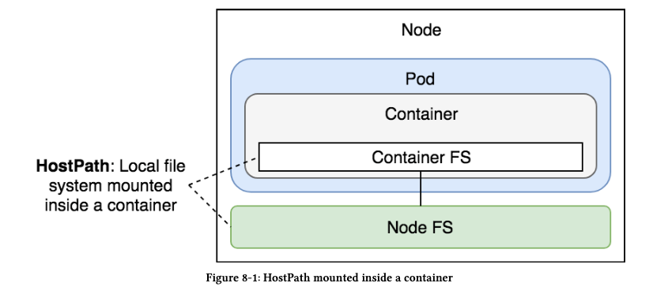

* Most of the time, stateful applications store their state on disk. That leaves us with a problem. If acontainer crashes,kubelet will restart it. The problem is that it will create a new container based on the same image. All data accumulated inside a container that crashed will be lost.

* Kubernetes Volumes solve the need to preserve the state across container crashes. In essence,Volumes are references to files and directories made accessible to containers that form a Pod. The significant difference between different types of Kubernetes Volumes is in the way these files and directories are created.

* There are over twenty-five Volume types supported by Kubernetes. It would take us too much time to go through all of them. Besides, even if we’d like to do that, many Volume types are specific to a hosting vendor. For example,***awsElasticBlockStore*** works only with AWS, ***azureDisk*** and ***azureFile*** work only with Azure, and so on and so forth.

## Accessing Host’s Resources Through hostPath Volumes

### Use Case 1 : Docker client running in the Pod and Docker server to be used is on the Host (Kube Master)

```
kubectl run docker --image=docker:17.11 --restart=Never docker image ls
pod/docker created

kubectl get pods
NAME     READY   STATUS   RESTARTS   AGE
docker   0/1     Error    0          11s

kubectl logs docker
Cannot connect to the Docker daemon at unix:///var/run/docker.sock. Is the docker daemon running?

```

* The error above is due becoz of the missing Docker server in the Pod.
* By default, the client sends instructions to the server through the socket located in /var/run/docker.sock. We can accomplish our goal if we mount that file from the host into a container.
* Deleting the Pod for now and proceeding to fix:

```
kubectl delete pod docker
pod "docker" deleted
```

* using volume/docker.yaml

```
apiVersion: v1
kind: Pod
metadata:
  name: docker
spec:
  containers:
  - name: docker
    image: docker:17.11
    command: ["sleep"]
    args: ["100000"]
    volumeMounts:
    - mountPath: /var/run/docker.sock
      name: docker-socket
  volumes:
  - name: docker-socket
    hostPath:
      path: /var/run/docker.sock
      type: Socket
```

* New flags used:
- volumeMounts: 
   mountPath: The path in the container where the mount is expected.
   name: Name of the volume

- volumes:
    hostPath: Allows us to mount a file or a directory from a host to Pods and, through them, to containers.
    Do not use ***hostPath*** to store a state of an application. Since it mounts a file or a directory from a host into a Pod, it is not fault-tolerant. If the server fails, Kubernetes will schedule the Pod to a healthy node, and the state will be lost.

    For our use case, ***hostPath*** works just fine. We’re not using it to preserve state, but to gain access to Docker server running on the same host as the Pod.

    - path: Directory we want to mount from the host.
    - type: Socket in this case.
        - Other types:
            Directory
            DirectoryOrCreate
            File
            FileOrCreate
            Socket
            CharDevice
            BlockDevice

* Creating the Pod:

```
kubectl create -f volume/docker.yml
pod/docker created

kubectl exec -it docker -- docker image ls --format "{{.Repository}}"

quay.io/kubernetes-ingress-controller/nginx-ingress-controller
mongo
vfarcic/devops-toolkit-series
k8s.gcr.io/kube-proxy
vfarcic/go-demo-2
quay.io/coreos/flannel
vfarcic/go-demo-2
vfarcic/go-demo-2
k8s.gcr.io/pause
docker
mongo
vfarcic/go-demo-2
mongo

```

* Even though we executed the docker command inside a container, the output clearly shows the images from the host. We proved that mounting the Docker socket (/var/run/docker.sock) as a Volume allows communication between Docker client inside the container, and Docker server running on the host.



HostPath mounted inside a container Let’s enter the container and see whether we can build a Docker image.

```
kubectl exec -it docker sh
```

To build an image, we need a Dockerfile as well as an application’s source code. 
We’ll continue using ***go-demo-2*** as the example, so our first action will be to clone the repository.

```
# running inside the Pods container

apk add -U git

git clone https://github.com/vfarcic/go-demo-2.git

cd go-demo-2/
```

* Investigating the Dockerfile

```
/go-demo-2 # cat Dockerfile
FROM golang:1.12.6 AS build
ADD . /src
WORKDIR /src
RUN go get -d -v
RUN go test --cover -v ./... --run UnitTest
RUN go build -v -o go-demo


FROM alpine:3.4
MAINTAINER      Viktor Farcic <viktor@farcic.com>

RUN mkdir /lib64 && ln -s /lib/libc.musl-x86_64.so.1 /lib64/ld-linux-x86-64.so.2

EXPOSE 8080
ENV DB db
CMD ["go-demo"]
HEALTHCHECK --interval=10s CMD wget -qO- localhost:8080/demo/hello

COPY --from=build /src/go-demo /usr/local/bin/go-demo
RUN chmod +x /usr/local/bin/go-demo
```

* Now testing the Image Build:

```
docker image build -t testimage/go-demo-2:beta .

docker image ls --format "{{.Repository}}"
testimage/go-demo-2

```

* So we also proved that we were able build a image.

* cleaning up:

```
exit # exiting out of the container

kubectl delete -f volume/docker.yml 
pod "docker" deleted

```

## Using hostPath Volume Type To Inject Configuration Files

Deploying a prometheus.

```

kubectl create -f volume/prometheus.yml --record --save-config
ingress.extensions/prometheus created
deployment.apps/prometheus created
service/prometheus created

kubectl rollout status deploy prometheus
deployment "prometheus" successfully rolled out


```

