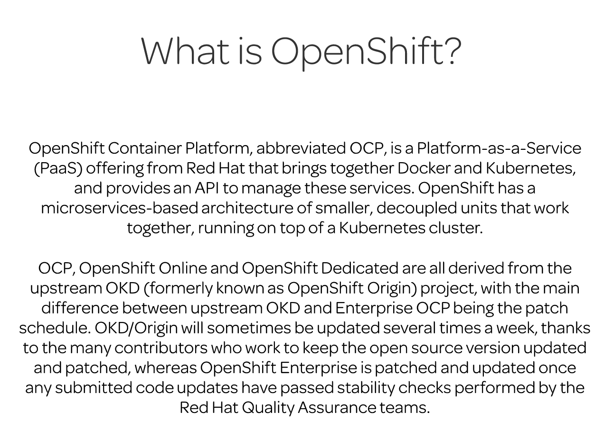

Openshift is PAAS with Docker & Kubernetes.

## Definition

The standard OpenShift cluster is composed of at least one master node (with 2 or more masters in an HA environment) and one or more nodes. Kubernetes manages containerized applications across a set of containers or hosts, and provides deployment mechanisms, application scaling, and maintenance, while Docker packages instantiates and runs containerized applications. OpenShift is a layered system designed to expose underlying Docker-formatted container images and Kubernetes concepts as accurately as possible, with a focus on easy composition of applications by a developer.

