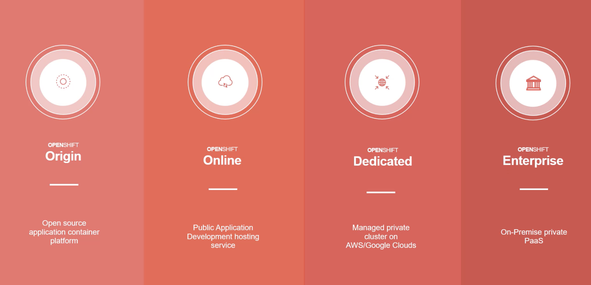
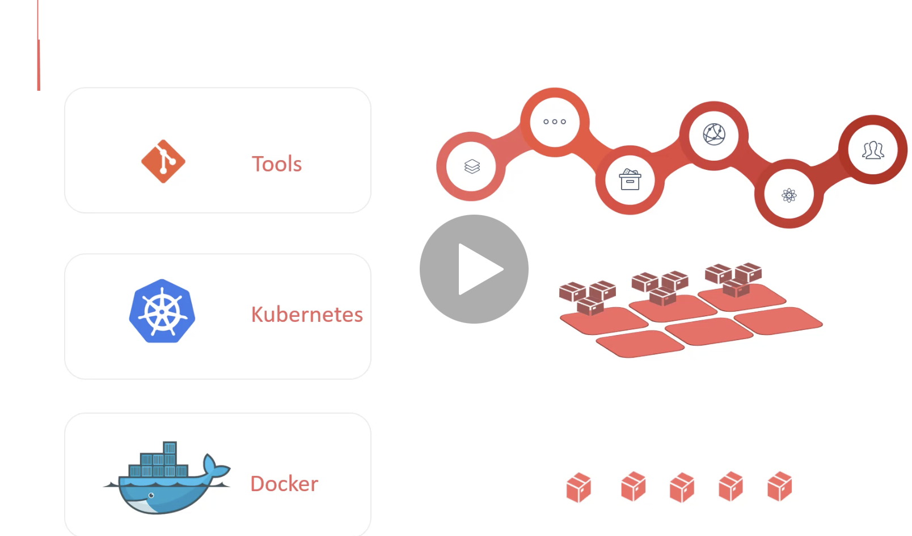
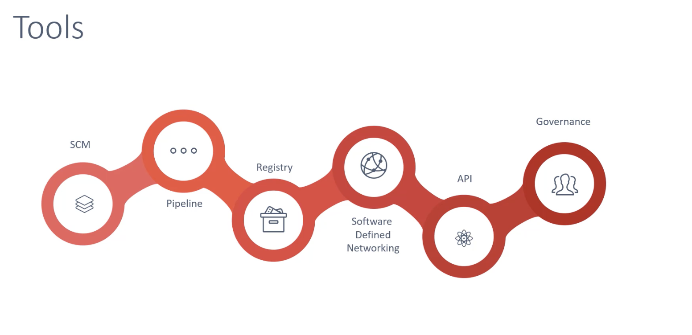
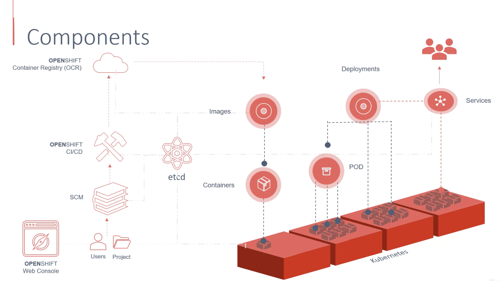
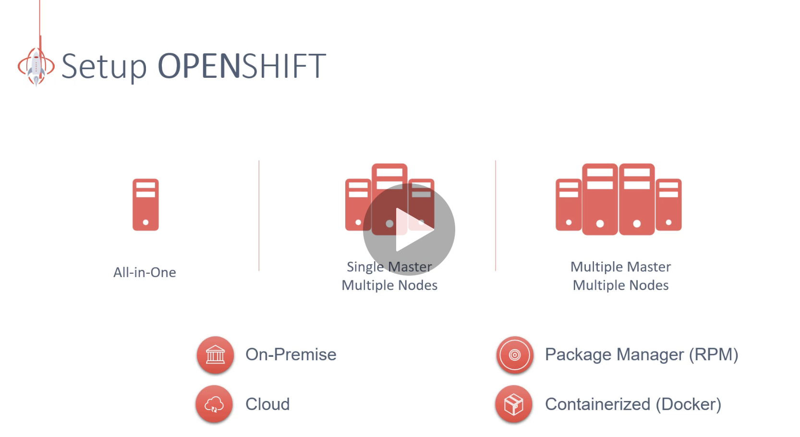
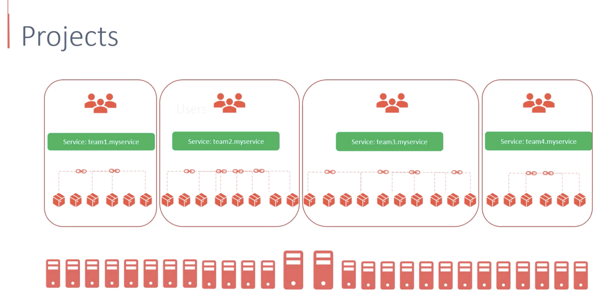
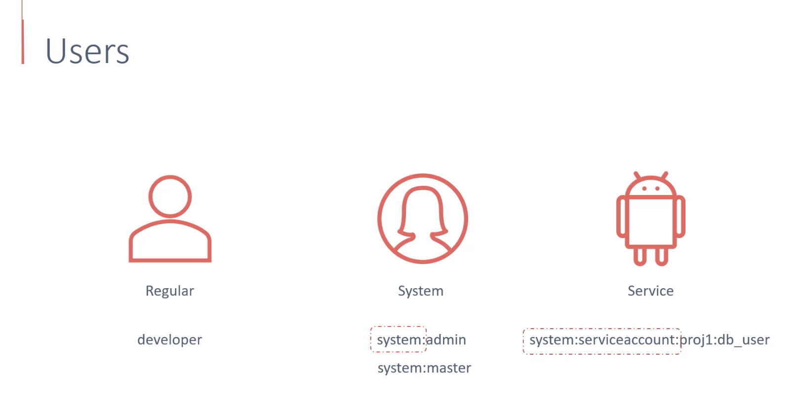
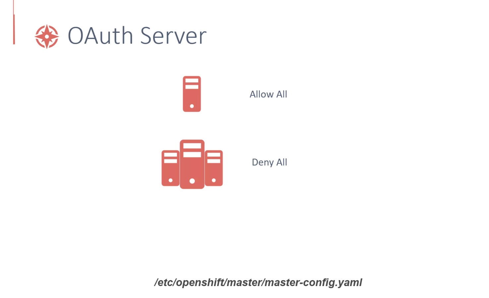
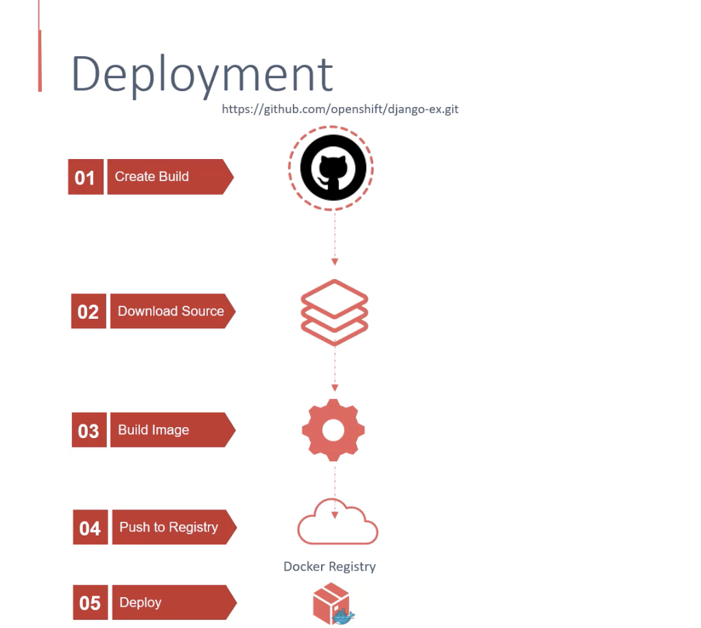

## Projects

* Uses Kubernetes namespaces underneath for isolation between projects.



* User types:


Take notice of the prefix for service & system users.

* OAuth settings:


```
oc get projects
oc get users
oc adm policy add-cluster-role-to-user cluster-admin administrator
```

## Builds and deployments



#### Build Strategies:
1. Dockerfile

2. S2I

3. 
