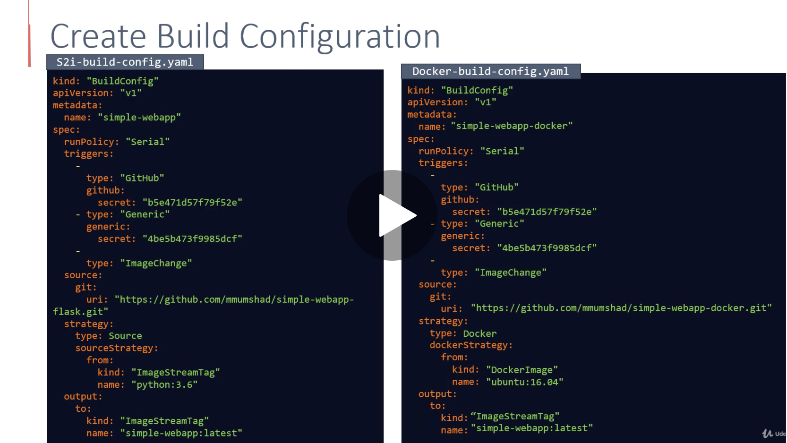
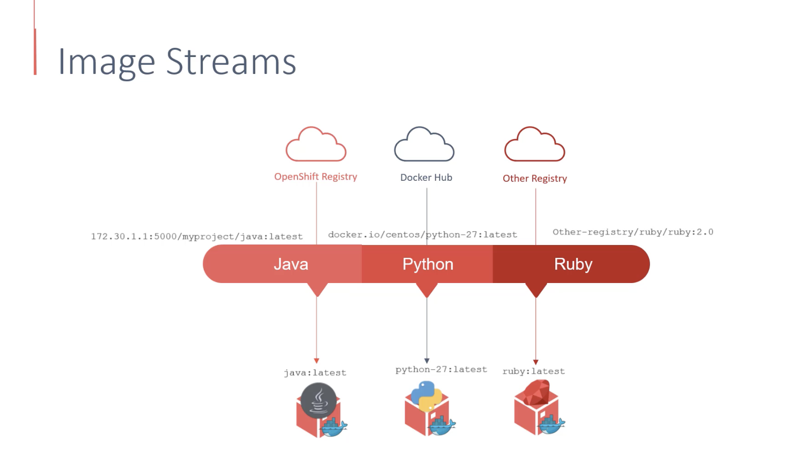

## Projects

* Uses Kubernetes namespaces underneath for isolation between projects.


* User types:


Take notice of the prefix for service & system users.

* OAuth settings:


```
oc get projects
oc get users
oc adm policy add-cluster-role-to-user cluster-admin administrator
```

## Builds and deployments


#### Build Strategies:
1. Dockerfile

2. S2I

3. Custom Build - Jenkins etc...



#### Image Streams:




#### Build Config Examples:

***S2I Example:***

```
kind: BuildConfig
apiVersion: build.openshift.io/v1
metadata:
  name: version
  namespace: anirondevops-1
  selfLink: /apis/build.openshift.io/v1/namespaces/anirondevops-1/buildconfigs/version
  uid: 49985054-8a2f-11ea-b279-0a580a810037
  resourceVersion: '40965720'
  creationTimestamp: '2020-04-29T15:37:09Z'
  labels:
    app: version
    app.kubernetes.io/component: version
    app.kubernetes.io/instance: version
  annotations:
    openshift.io/generated-by: OpenShiftNewApp
spec:
  nodeSelector: null
  output:
    to:
      kind: ImageStreamTag
      name: 'version:latest'
  resources: {}
  successfulBuildsHistoryLimit: 5
  failedBuildsHistoryLimit: 5
  strategy:
    type: Source
    sourceStrategy:
      from:
        kind: ImageStreamTag
        namespace: openshift
        name: 'nodejs:10'
  postCommit: {}
  source:
    type: Git
    git:
      uri: 'https://github.com/anirondevops/DO101-apps.git'
    contextDir: version
  triggers:
    - type: GitHub
      github:
        secret: H-W1UvxbUHM3SRMnmXD6
    - type: Generic
      generic:
        secret: jxomxD8o9gERU0uuf_xY
    - type: ConfigChange
    - type: ImageChange
      imageChange:
        lastTriggeredImageID: >-
          image-registry.openshift-image-registry.svc:5000/openshift/nodejs@sha256:74a3ef2964efc03dfc239da3f09691b720ce54ff4bb47588864adb222133f0fc
  runPolicy: Serial
status:
  lastVersion: 3
```